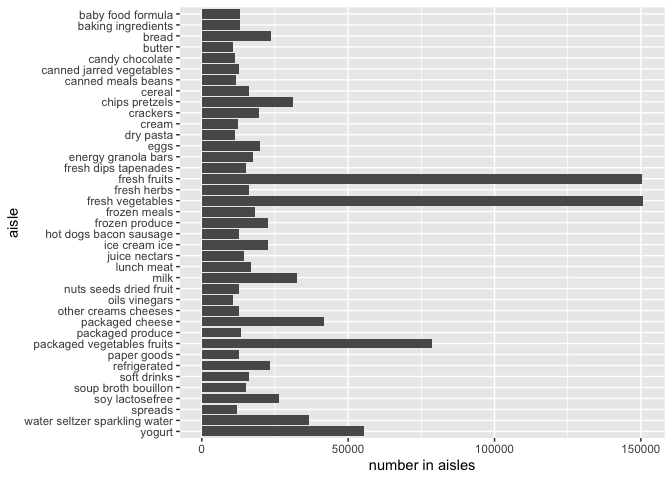
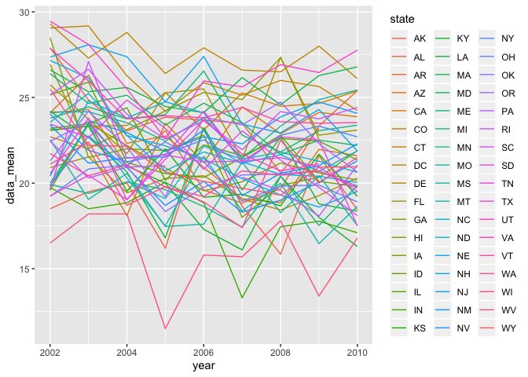
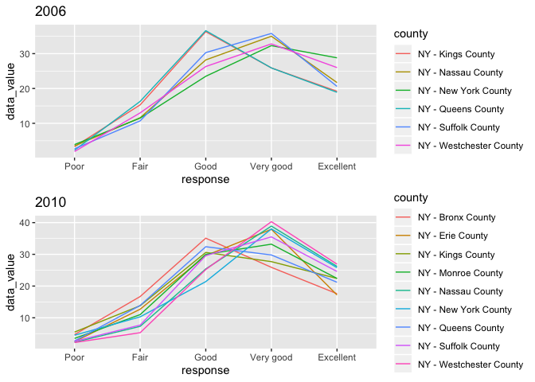
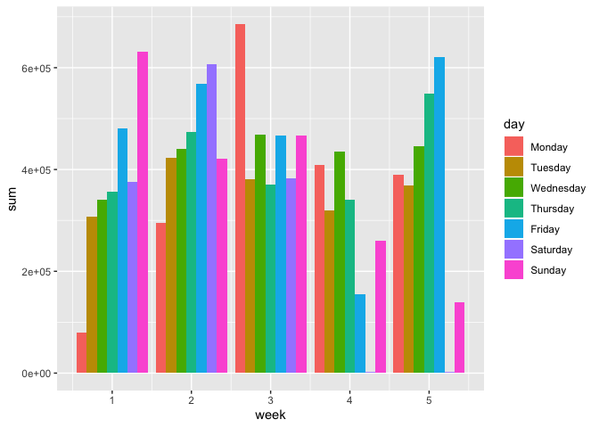
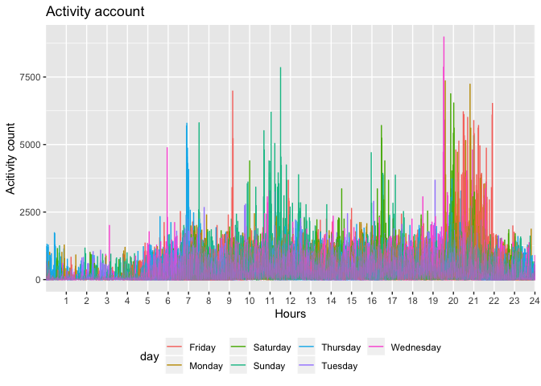

HW3
================
Xinyu Shen

Problem 1
---------

``` r
library(tidyverse)
```

    ## ── Attaching packages ──────────────────────────────────────────────────────────────────────────── tidyverse 1.2.1 ──

    ## ✔ ggplot2 3.2.1          ✔ purrr   0.3.2     
    ## ✔ tibble  2.1.3          ✔ dplyr   0.8.3     
    ## ✔ tidyr   1.0.0.9000     ✔ stringr 1.4.0     
    ## ✔ readr   1.3.1          ✔ forcats 0.4.0

    ## ── Conflicts ─────────────────────────────────────────────────────────────────────────────── tidyverse_conflicts() ──
    ## ✖ dplyr::filter() masks stats::filter()
    ## ✖ dplyr::lag()    masks stats::lag()

``` r
library(p8105.datasets)
data("instacart")
```

The dataset instacart has dimention of 1384617 X 15. It has 1384617 variables, which are order\_id, product\_id, add\_to\_cart\_order, reordered, user\_id, eval\_set, order\_number, order\_dow, order\_hour\_of\_day, days\_since\_prior\_order, product\_name, aisle\_id, department\_id, aisle, department. The key variables is the product\_name, which help us to locate the product we want. The product\_id variable can help us easily count how many such products were purchased, so it is important as well. For example, if the seller want to know how popular the spring water is, the seller can use the product name to locate the product and get its product id. Then the seller can count how many times this product id shows in the datasets, to know how popular the product is.

``` r
aisles_count = length(unique(pull(instacart, "aisle")))
df_most_item_aisle = instacart %>% group_by(aisle_id) %>% summarize(n=n()) 
most_item_aisle=max(df_most_item_aisle$n)
most_aisle_id = df_most_item_aisle$aisle_id[which(df_most_item_aisle$n==max(most_item_aisle))]
most_aisle_name = filter(instacart, aisle_id == most_aisle_id)[["aisle"]][1]
```

``` r
df_item_aisles = instacart %>% group_by(aisle) %>% summarize(n=n()) 
item_plot = filter(df_item_aisles, n>10000) %>% mutate( 
  aisle= as.ordered(aisle)
  )
ggplot(item_plot, aes(x= aisle, y= n )) + geom_bar(stat = "identity")+ ylab("number in aisles") + coord_flip() +
  scale_x_discrete(limits = rev(levels(item_plot$aisle)))
```



``` r
df_three_most = instacart %>% filter(aisle %in% c("baking ingredients", "dog food care","packaged vegetables fruits")) %>% group_by(aisle, product_name) %>% summarize(num_times=n()) %>% arrange(-num_times, .by_group = TRUE) %>% top_n(3)
df_three_most
```

    ## # A tibble: 9 x 3
    ## # Groups:   aisle [3]
    ##   aisle                   product_name                            num_times
    ##   <chr>                   <chr>                                       <int>
    ## 1 baking ingredients      Light Brown Sugar                             499
    ## 2 baking ingredients      Pure Baking Soda                              387
    ## 3 baking ingredients      Cane Sugar                                    336
    ## 4 dog food care           Snack Sticks Chicken & Rice Recipe Dog…        30
    ## 5 dog food care           Organix Chicken & Brown Rice Recipe            28
    ## 6 dog food care           Small Dog Biscuits                             26
    ## 7 packaged vegetables fr… Organic Baby Spinach                         9784
    ## 8 packaged vegetables fr… Organic Raspberries                          5546
    ## 9 packaged vegetables fr… Organic Blueberries                          4966

``` r
df_p_c = instacart %>% filter(product_name %in% c('Pink Lady Apples', 'Coffee Ice Cream')) %>% select(product_name,order_dow, order_hour_of_day) %>% group_by(product_name, order_dow) %>% summarize(mean = mean(order_hour_of_day)) %>% pivot_wider(names_from = order_dow, values_from = mean) 
df_p_c
```

    ## # A tibble: 2 x 8
    ## # Groups:   product_name [2]
    ##   product_name       `0`   `1`   `2`   `3`   `4`   `5`   `6`
    ##   <chr>            <dbl> <dbl> <dbl> <dbl> <dbl> <dbl> <dbl>
    ## 1 Coffee Ice Cream  13.8  14.3  15.4  15.3  15.2  12.3  13.8
    ## 2 Pink Lady Apples  13.4  11.4  11.7  14.2  11.6  12.8  11.9

Problem 2
---------

``` r
data("brfss_smart2010") 
df_ptwo = brfss_smart2010 %>% janitor::clean_names() %>% select("state" = locationabbr, "county" = locationdesc, everything()) %>% filter(topic == "Overall Health") %>% mutate(
  response = factor(response, levels = rev(unique(response)))
) %>% arrange(desc(response), .by_group = TRUE)

df_2002 = filter(df_ptwo, year == 2002) %>% group_by(state,county) %>% summarize(obs_n = n()) %>% select(state,county) %>% ungroup() %>% group_by(state) %>% summarize(n=n())%>% filter(n >= 7)
df_2010 = filter(df_ptwo, year == 2010) %>% group_by(state,county) %>% summarize(obs_n = n()) %>% select(state,county) %>% ungroup() %>% group_by(state) %>% summarize(n=n())%>% filter(n >= 7)
df_2002
```

    ## # A tibble: 6 x 2
    ##   state     n
    ##   <chr> <int>
    ## 1 CT        7
    ## 2 FL        7
    ## 3 MA        8
    ## 4 NC        7
    ## 5 NJ        8
    ## 6 PA       10

``` r
df_2010
```

    ## # A tibble: 14 x 2
    ##    state     n
    ##    <chr> <int>
    ##  1 CA       12
    ##  2 CO        7
    ##  3 FL       41
    ##  4 MA        9
    ##  5 MD       12
    ##  6 NC       12
    ##  7 NE       10
    ##  8 NJ       19
    ##  9 NY        9
    ## 10 OH        8
    ## 11 PA        7
    ## 12 SC        7
    ## 13 TX       16
    ## 14 WA       10

In 2002, CT, FL, MA, NC, NJ, PA were observed 7 or more locations, and in 2010, CA, CO, FL, MA, MD, NC, NE, NJ, NY, OH, PA, SC, TX, WA were observed 7 or more locations. Compared to 2002, more states have 7 or more location observed.

``` r
df_pthree = df_ptwo %>% filter(response == "Excellent") %>% group_by(year, state) %>% summarize(data_mean = mean(data_value)) %>% ungroup()

ggplot(df_pthree, aes(x= year, y= data_mean)) + geom_line(aes(color = state))
```

 Based on the plot, most states' data were ranged between 17.5 to 27.5, showing that the data were not changed significantly.

``` r
library(patchwork)
df_pthree_2006 = df_ptwo %>% filter(year == 2006 & state == "NY")
df_pthree_2010 = df_ptwo %>% filter(year == 2010 & state == "NY")
plot_06 = ggplot(df_pthree_2006, aes(x=response, y= data_value)) + geom_line(aes(color = county, group=county))+ggtitle("2006")
plot_10 = ggplot(df_pthree_2010, aes(x=response, y= data_value)) + geom_line(aes(color = county, group=county)) + ggtitle("2010")
plot_06 / plot_10
```



From the plot, we can see that better the response is, higher the data value.

Problem 3
---------

``` r
df_acc = read_csv("./accel_data.csv") %>% janitor::clean_names() %>% pivot_longer(
  cols = starts_with("act") ,
  names_to = "visit",
  values_to = "activity_count") %>% mutate(
    wk_wek = ifelse(day == "Saturday" | day == "Sunday", "weekend", "weekday")
  )
```

The dataset exits the variables such as week, day\_id, day, visit, activity\_count, wk\_wek, and has dimention of 50400 X 6, which contains 50400 observations.

``` r
week_order = c("Monday","Tuesday","Wednesday","Thursday","Friday","Saturday","Sunday")
df_total_ac = df_acc %>% group_by(week, day) %>% summarize(sum = sum(activity_count)) %>% ungroup() %>% mutate(
  wd_wk = ifelse(day == "Saturday" | day == "Sunday", "weekend", "weekday"),
  day = factor(day, levels = week_order)
  )
df_total_ac
```

    ## # A tibble: 35 x 4
    ##     week day           sum wd_wk  
    ##    <dbl> <fct>       <dbl> <chr>  
    ##  1     1 Friday    480543. weekday
    ##  2     1 Monday     78828. weekday
    ##  3     1 Saturday  376254  weekend
    ##  4     1 Sunday    631105  weekend
    ##  5     1 Thursday  355924. weekday
    ##  6     1 Tuesday   307094. weekday
    ##  7     1 Wednesday 340115. weekday
    ##  8     2 Friday    568839  weekday
    ##  9     2 Monday    295431  weekday
    ## 10     2 Saturday  607175  weekend
    ## # … with 25 more rows

``` r
ggplot(df_total_ac, aes(x=week, y = sum, fill = day)) + geom_bar(stat = 'identity', position = position_dodge())
```



From the plot, we can see that for the week 1,2 and 5, the activity total is increasing from Monday to Sunday. And in the week 3, Monday has significantly higher activity than other day and in week 4, Sunday has very low activity. And for week 4 and 5, in the Saturday, there is almost no activity for those two days.

``` r
df_acc2 = df_acc %>% mutate(
  visit = factor(substr(visit,10,1000), ordered = TRUE, levels = c(1:1440))
)
ggplot(df_acc2 %>% ungroup() %>% ungroup(), aes(x=factor(visit), y=activity_count, color = day)) +
  scale_x_discrete(breaks = seq(60,1440,60),labels = as.character(c(1:24))) +
  geom_line() +
  labs(title = "Activity account",
       x = "Hours",
       y = "Acitivity count") +
  theme(legend.position = "bottom")
```



From the plot, we can see that the activity peak shows between 19:00 to 22:00, which means the patient have most activity for a day. Also, we can see that in Sunday, the paitient prefer to move more between 11:00 and 12:00, and in Saturday, the paiteint prefer to move around 16:30. In Thursday, the paitient prefer to move at 7:00, which might be his weekly exercise time. In summary, the paitient move more during the weekdend, compared to the weekday.
